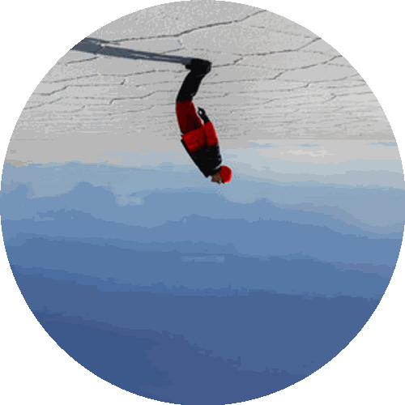

  

  プロジェクト・マキマ 
  <i>"In the silence of the code, the devil listen."</i>

  
  
  

<h2 align="center">📨 Contact / 連絡先</h2>

<i>静 — silencio.</i>

💬 <b>Discord:</b> zaekoram  
🎮 <b>Steam:</b> <a href="https://steamcommunity.com/id/zaekoram10/">ZaekoRam</a>  
✉️ <b>Email:</b> jramirez195@ucol.mx  

 

  
   
  <i>NOW LOADING… 静かに従え。</i>

<!-- ★ SPOTIFY CUSTOM PLAYER RECTANGULAR ★ -->

<!-- Disco -->

<!-- Texto -->

SPOTIFY ⏸⏸ NOW PLAYING 
<b>Nueva Era</b> 
Duki 
AMERI • 02:51

<!-- Controles -->

  🔀 ⏮ ⏸ ⏭ 🔁

<!-- Barra -->

  ▶ ▁▂▃▅▆▇██ 1:07 / 2:51

━━━━━━━━━━━━━━━━━━━━━━━━━━━━━━ ✦ ━━━━━━━━━━━━━━━━━━━━━━━━━━━━━━

# 𖤐 こんにちは, I'm Carlo Ramirez!

- Python dev · Pygame enjoyer · Chainsaw Man addict  
- Me gusta muchisímo la música y los videojuegos.  
- Suelo tocar el piano en mis tiempos libres.
