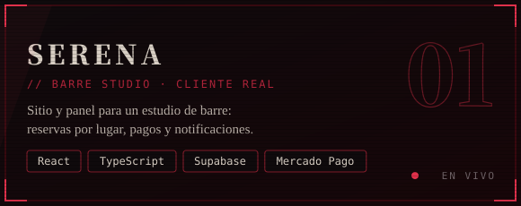
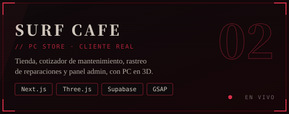
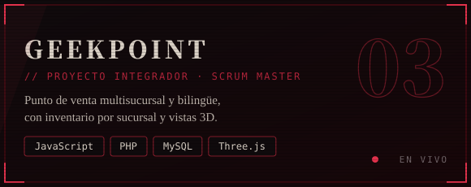
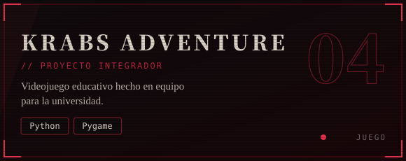

  

  
  
  
  

  

<h2 align="center">⸸ 作品 · PROYECTOS ⸸</h2>

<i>lo que he invocado hasta ahora</i>

<table align="center">
  <tr>
    <td></td>
    <td></td>
  </tr>
  <tr>
    <td></td>
    <td></td>
  </tr>
</table>

  
  
  

<h2 align="center">⸸ 武器 · ARSENAL ⸸</h2>

  
  
  
  
  
   
  
  
  
  
  
  
   
  
  
  
  
  

<h2 align="center">⸸ 記録 · REGISTRO ⸸</h2>

  
  

  

  
   
  <i>NOW LOADING… 静かに従え。</i>

  

<h2 align="center">⸸ 連絡先 · CONTACTO ⸸</h2>

  
  
  

  

